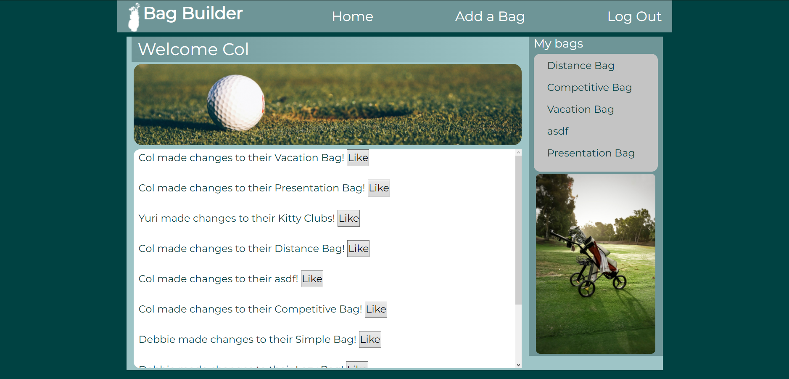
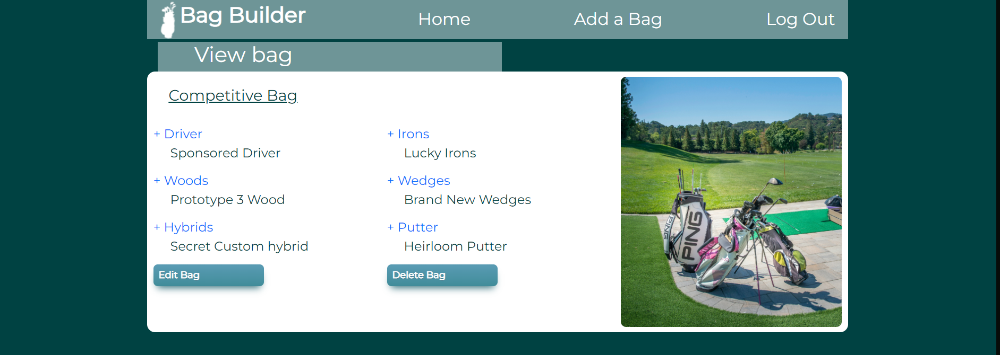

# Golf Bag Builder
> Log in, create some custom golf loadouts, and check in with other users to see what gear they're using!

## Table of contents
* [General info](#general-info)
* [Technologies](#technologies)
* [Setup](#setup)
* [Features](#features)
* [Inspiration](#inspiration)
* [Contact](#contact)
* [License](#license)

## General info
Golf Bag Builder is a simple to use, modern, and user friendly tool for golfers. This application allows a user to create different golf bag loadouts for different situations.

<div align="center">Golf Bag Builder</div>
<br/>
<div align="center">
<kbd>

</kbd>
</div>

<br/>
<div align="center">
<kbd>

</kbd>
</div>

## Technologies
### Backend Development
* Python - version 3.9
* Flask - version 2.0.2
* Bcrypt - version 3.2.0
* pymysql - version 1.0.2
* cffi - version 1.15.0

### Frontend Development
* HTML5
* CSS3
* Bootstrap

## Setup
To try out this project:
1. Clone this repository to your computer
2. In the command line, navigate to the root directory and type:
  $ pip install pipenv
3. Then, create a virtual environment:
  $ pipenv shell
4. Install dependencies from the requirements.txt file:
  $ pip install -r requirements.txt
6. To start the server, type python server.py
7. In your browser, navigate to http://localhost:5000

## Code Examples
### flask_app/models/bag.py
```python
class Bag:
    db = "bag_builder"
    def __init__(self, data):
        self.id = data['id']
        self.name = data['name']
        self.driver = data['driver']
        self.woods = data['woods']
        self.hybrids = data['hybrids']
        self.irons = data['irons']
        self.wedges = data['wedges']
        self.putter = data['putter']
        self.content = data['content']
        self.user_id = data['user_id']
        self.created_at = data['created_at']
        self.updated_at = data['updated_at']
        self.likers = []

        # self.likers will be list of id's that have liked a given bag

    @classmethod
    def get_all(cls):
        query = "SELECT * FROM bags JOIN users ON bags.user_id = users.id ORDER BY bags.updated_at DESC"
        bags_from_db = connectToMySQL(cls.db).query_db(query)
        bags = []
        for row in bags_from_db:
            bags.append(cls(row))
        return bags

    @classmethod
    def get_all_by_creator(cls, data):
        query = "SELECT * FROM bags JOIN users ON bags.user_id = users.id WHERE bags.user_id = %(id)s;"
        bags_from_db = connectToMySQL(cls.db).query_db(query, data)
        bags_by_creator = []
        for bag in bags_from_db:
            bags_by_creator.append(cls(bag))
        return bags_by_creator
```
### flask_app/controllers/users.py
``` python
@app.route('/register',methods=['POST'])
def register():
    if not User.validate_register(request.form):
        return redirect('/')
    data ={
        "first_name": request.form['first_name'],
        "last_name": request.form['last_name'],
        "email": request.form['email'],
        "password": bcrypt.generate_password_hash(request.form['password'])
    }
    print(data)
    id = User.create(data)
    session['user_id'] = id
    return redirect('/dashboard')

@app.route('/login',methods=['POST'])
def login():
    user = User.get_by_email(request.form)
    if not user:
        flash("Invalid Email/Password","login")
        return redirect('/')
    if not bcrypt.check_password_hash(user.password, request.form['password']):
        flash("Invalid Email/Password","login")
        return redirect('/')
    session['user_id'] = user.id
    return redirect('/dashboard')
```
## Features
* Full stack web application utilizing Python, Flask, and MySQL
* Authorization and authenication implemented with flask-bcrypt. 
* Front-End styles and tables built with Boostrap and manual CSS 
* Users can create account through application. 
* Users can add profile information, and create, edit, or delete their bags
* View the bags and contents of other users, and give likes to user activity

## Status
Project is finished.

## Inspiration
The inspiration for Golf Bag Builder came when I was enjoying my favorite pastime on a windy day. It occurred to me that depending on weather, length of course, and convenience, I may not need every club in my bag. To keep track of the essentials, I created Golf Bag Builder to be prepared for any round.

## Contact
Created by Cole Robinson (https://www.linkedin.com/in/cwrobinson-/)
Let me know what you think! All feedback welcome.

## License
https://github.com/Col-R/golfbag_builder/blob/master/LICENSE.md
